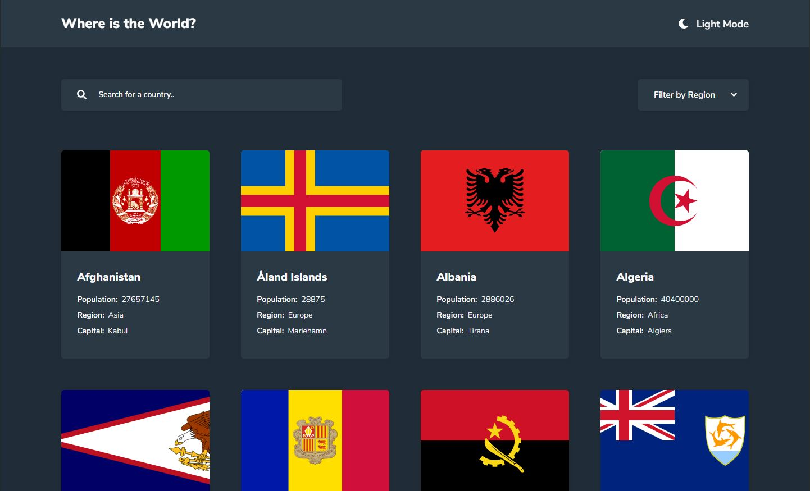

<h1 align="center">Countries Searching</h1>

 
 

# Project
 
This project is a challenge from [Front-end Mentor](https://www.frontendmentor.io/) website, its a searching country app that consumes [REST Country](https://restcountries.eu/) API

 

# Technologies
- Angular
- RxJS
- NgRx
- SASS
- JEST

 

# Running project

This project was generated with [Angular CLI](https://github.com/angular/angular-cli) version 11.0.5.

## Development server

Run `ng serve` for a dev server. Navigate to `http://localhost:4200/`. The app will automatically reload if you change any of the source files.

## Code scaffolding

Run `ng generate component component-name` to generate a new component. You can also use `ng generate directive|pipe|service|class|guard|interface|enum|module`.

## Build

Run `ng build` to build the project. The build artifacts will be stored in the `dist/` directory. Use the `--prod` flag for a production build.

## Running unit tests

Run `ng test` to execute the unit tests via [Karma](https://karma-runner.github.io).

## Running end-to-end tests

Run `ng e2e` to execute the end-to-end tests via [Protractor](http://www.protractortest.org/).

## Further help

To get more help on the Angular CLI use `ng help` or go check out the [Angular CLI Overview and Command Reference](https://angular.io/cli) page.
